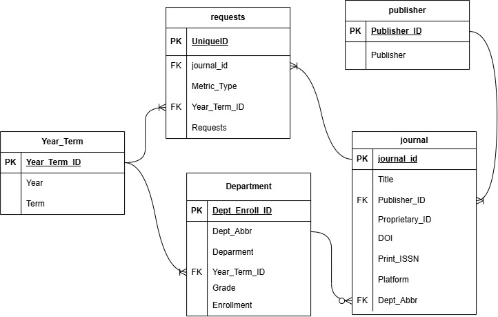
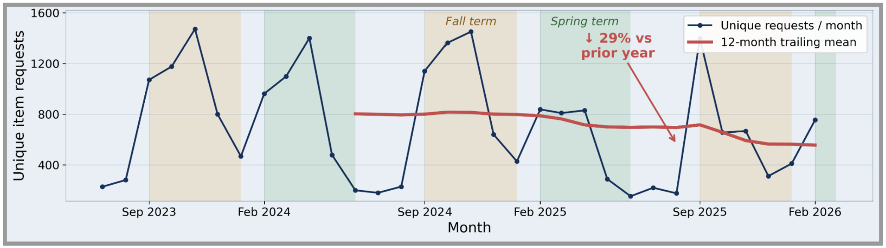
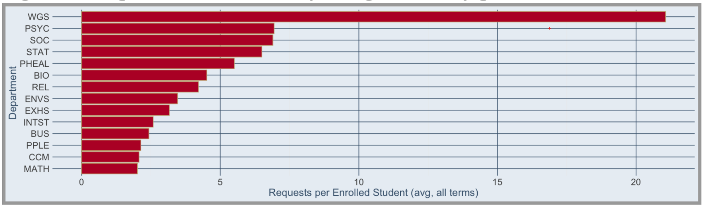
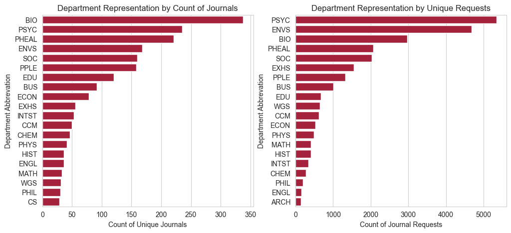

# Reading the Data - An Analysis of Willamette University Library's E-Resource Usage

## The one-liner

> We integrated **library e-resource usage data** into **unversity enrollment data** so that
> **Willamette University's librarians** can **identify patterns in the usage of resources and support decision-making on which resources to invest in**.

**Role:** Translated findings into actionable recommendations for the librarians and analyzed journal package usage over time.

**Team:** [Sophia Rabbanian](https://sophiarabb.github.io/), [Emily Strickland](https://emvstrick.github.io/)

**Repo:** [github.com/sophiarabb/data510-libraries](https://github.com/sophiarabb/data510-libraries)

## The question

Willamette University has 3 libraries: Mark O. Hatfield Library (Salem Main Campus), J.W. Long Law Library (Salem Law Campus), and the Albert Solheim Library (PNCA Portland Campus). Each library has their own physical resources as well as shares a collection of electronic resources among all libraries. This includes journals, research papers and articles, and often come in packages bought by the library from publishers. In recent years, the WU Librarians have had no avenue to analyze patterns in journal requests and usage.

The library staff desires to understand the Willamette community's online journal usage as a whole as well as how it relates to enrollment in different departments. Through our analysis, the librarians will be able to consider which electronic materials are the most important to maintain, and which to deprioritize. Since some departments are smaller, they may be more likely to be hit by cuts if their resources have lower usage request figures. Willamette’s librarians are striving to optimize their resources while maintaining fairness between departments and being good stewards of research.


## The data

This project combines data from 2 different sources: WU Library Usage Request Reports and the Willamette University Factbooks. While the data was fairly clean and complete, there was some work to do for both data sources before it was possible to download it. We needed to label each journal with its subject, and write a script to get the enrollment information into a digestible file type.

This data was downloaded and ingested into a PostgreSQL database where it was placed into staging tables. The new tables were then created, and the data was inserted from the staging tables into the new organized tables, which contained the appropriate foreign and primary keys to ensure ease in using joins for our analysis. Our organized schema can be seen below:




## The approach

We use exploratory analysis and descriptive statistics rather than predictive modeling. The stakeholder question is descriptive: which resources are being used, by whom, and how usage is changing over time. A predictive model would answer a question the librarians did not ask, and with under three years of monthly data there is not enough history to train or validate one honestly.

## Findings



Usage tracks the academic calendar closely. Requests peak in the middle of each term, fall off sharply during winter and summer breaks, and reach their yearly low in June and July. Fall consistently produces the highest sustained usage of the three terms.

The clearer finding is the direction of the trend. The twelve month trailing mean fell from roughly 787 unique requests per month to roughly 556, a decline of 29% over the most recent year. Because the panel of journals is held constant, this is not a reporting gap. The decline also appears within the publishers that supplied a single continuous export file, which rules out the deduplication step as a cause. We report the decline as real and note that this analysis cannot identify its cause. The rise of large language models as a research tool is one plausible explanation, but nothing in this data tests it.

{fig-alt="Placeholder capstone figure" width="90%"}

Women’s & Gender Studies (WGS) is a huge outlier, with an average of 3.88 majors per term, but 957 total requests. While 957 is not a particularly high amount of requests (9th overall), having such low enrollment leads to the outlier. While there is no obvious reason for why this might be, we hypothesize that it could be a mix of:

1. popular topics for research in WGS journals, which mostly focus on sexuality, gender identity, or women’s studies

2. classes in other departments, like PNCA’s liberal arts, using WGS-labeled journals

3. use by other campus organizations like the Gender Resource & Advocacy Center (GRAC).

{fig-alt="Placeholder capstone figure" width="90%"}

Figure 5 ranks the top 20 departments represented within this dataset based on the count of journals and total unique journal requests. The left most figure ranks departments by the count of unique journals categorized under that department. The right most figure ranks departments by total unique requests. The horizontal axis represents the metric for ranking (Count of Unique Journals or Unique Journal Requests). The vertical axis indicates the department.

The top 5 departments remain consistent in terms of representation ranking across both metrics. However, several departments show some discrepancy between count of journals and usage. These include:

- **Women’s Gender Studies (WGS):**  By count of journals, WGS was ranked 18th, while in terms of requests, WGS is ranked 10th.

- **Computer Science (CS):** By count of journals, CS is ranked 20th. By requests, CS does not make the top 20.

- **Chemistry (CHEM):** By count of journals, CHEM is ranked 13th. By requests, CHEM is ranked 17th.

- **Exercise Health Science (EXHS):** By count of journals, EXHS ranks 10th. By requests, EXHS is ranked 6th.

- **Math (MATH):** By count of journals, MATH ranks 17th. By requests, MATH ranks 14th.


## Discussion & Recommendations

The analysis of usage patterns based on semesters, departments/subject matters, course offerings, and publisher revealed several strong patterns. These patterns indicate changing resource usage, so our suggestions link student research behavior, enrollment, and publisher offerings to support navigating these shifts.


<details>
  <summary> Recommendation 1: Promote Library E-Resources Early in the Semester</summary>

  Findings from this analysis indicate an overall decline in usage of e-resource materials. All current hypotheses connect back to student research habits. Considering that usage often peaks at the midpoint of each semester, Willamette’s teaching librarians can take advantage of the early semester weeks to visit classes that heavily rely on academic research. This includes capstone courses, capstone prep-classes, and other research/literature review-heavy courses. These visits allow librarians to promote the e-resources and demonstrate how e-resources at Willamette’s libraries can be utilized prior to usage peaks in the semester.

</details>

<details>
  <summary> Recommendation 2: Consider Enrollment per semester while taking note of overall campus topic interests</summary>

  As enrollment for a major during a given semester increases, usage requests for journals relating to that subject also increase. This is a feature to consider when identifying which topic areas/journals students may request most and which are important to invest in. Outliers, such as the Women’s and Gender Studies major, where enrollment is low but requests per student are high, present another feature to consider. We hypothesize this discrepancy is due to the popularity of WGS at Willamette and its interdisciplinary use across multiple majors and schools. Willamette’s librarians should consider enrollment within academic disciplines but also consider which topics are known to be interdisciplinary and generally popular across campus.

</details>

<details>
  <summary> Recommendation 3: Consider resources for Women’s and Gender Studies (WGS)</summary>

  When considering publishers and representation of journals across departments,  Springer and Sage tend to have a larger collection of unique journals, but Taylor & Francis, though smaller by total count of journals, has a higher number of departments represented. Furthermore, analysis shows that WGS is unique as it is ranked lower in representation of journals, yet ranks higher in terms of requests, and requests per student enrolled in the department. Furthermore, for Taylor & Francis, WGS (along with Math) appears to be one of the most requested topics/departments. This may indicate that, at the least, resources for WGS should be considered. Taylor & Francis should also be considered because it represents a wider variety of departments and seems to fulfill requests for WGS materials.

</details>


## Deliverables

::: {.panel-tabset}

### Poster

<iframe src="projects/capstone/M5%20Final%20Poster.pdf" width="100%" height="800px"
  style="border: 1px solid #ddd; margin-top: 1rem;">
</iframe>

### Embedded PDF

```markdown
Coming Soon!

```
:::
<!-- [Download the write-up (PDF)](projects/capstone/writeup.pdf){.btn .btn-primary}

<iframe src="projects/capstone/M5%20Final%20Poster.pdf" width="100%" height="800px"
  style="border: 1px solid #ddd;"></iframe> -->

## Dig deeper

- 📦 **Code & Pipeline:** [GitHub Repository](https://github.com/sophiarabb/data510-libraries)
- 📊 **Poster:** [Final Poster](projects/capstone/M5%20Final%20Poster.pdf)
- 🌐 **Capstone Website:** [Capstone Website](https://sophiarabb.github.io/reading-the-data-capstone.github.io/)
