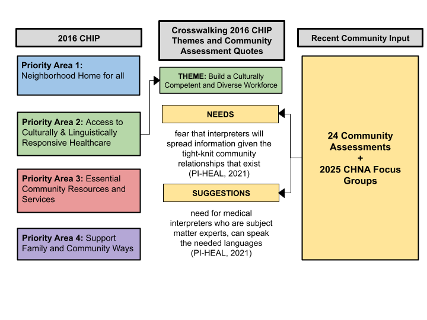

# Exploring Multiaceted Approaches to Engaging Community Voice to Assess and Understand Community Health Needs

## The One-Liner

> We integrated a mixed methods approach to develop the **2026-2029 Multnomah County Community Health Improvement Plan (CHIP)** by combining **qualitative data** (community engaged research and focus groups) with **quantitative data** (county health indicators) so that the
> **Multnomah County Health Department** can **identify key priority areas and strategies to invest in to support community health and decrease health inequities in Multnomah County**.

**Role:** Led analysis of community informed data through analysis of previous community assessments and coordinated analysis of Focus Groups.

## The Summary

Public health has long sought to assess community health needs accurately. However, disparities remain between traditional assessment methods and the ability to capture community voice and experiences. To engage multiple community voices, the Multnomah County Health Department (MCHD) utilized a multifaceted approach for the Community Health Improvement Plan (CHIP) development. This paper discusses the efforts used by MCHD to develop the CHIP priority areas and strategies. By examining multiple approaches, this project documents and encourages inclusive and collaborative community assessments that are foundational to public health practice.

## Background - What is a CHIP?

Multnomah County's CHIP is a 3-5 year plan that identifies key priorities affecting community health, as well as the strategies and resources that will be used to address those priorities. The CHIP is not limited to issues clarified within traditional public health or health services categories, and includes issues relating to other sectors such as the environment, business, and housing that affect local health.  Thus, the CHIP aims to improve organizational and community collaboration and emphasizes the interconnectedness of activities to support the improvement of local public health systems. Furthermore, the CHIP is developed collaboratively by various community stakeholders and is based on quantitative and qualitative data, as well as community input and wisdom. 

## Methods - How is the Multnomah County Health Department CHIP informed?

Data was used to inform the MCHD CHIP in two different stages. Each stage utilized different data and methods to understand and make sense of both quantitative and qualitative data to inform and update the Multnomah County Community Health Improvement Plan (CHIP).

### Stage 1: Analyzing Health Data and Community Input to Draft CHIP Goals and Strategies

This stage utilized both quantitative and qualitative data to draft CHIP goals and strategies. Data utilized during this stage includes:

**Recently Conducted Community Health Assessments and Recent Community Input**

> In collaboration with Health Department programs, our team collected 24 community engaged assessments completed within the last five years that contained community input. These assessments were then analyzed to identify the community's most recent needs (e.g. challenges, barriers) and most recent suggestions (things the community would like to see to support their health).

> By cross-walking and understanding how community experiences have changed regarding the county's previous priorities, allows our team to update the CHIP priority areas and strategies and establish the foundational priority areas for our draft CHIP.

**Health Outcome Indicators**

> Health Outcome Indicators are quantifiable measures used to evaluate the changes in a population's health state including: disease burden, chronic disease, life expectancy, rates of violence. Our analysis utilized traditional public health indicators to identify where there are health disparities regarding race and income. Identifying health disparities allow us to refine the priorities and strategies identified through our analysis of community input.

The findings from Stage 1 of our analysis resulted identifying 3 Priority Areas and 12 Strategies that are directly informed by community feedback and data.

::: {.panel-tabset}

### 1. Healthy and Connected Communities

**Goal:** Everyone has access to spaces where they live, learn, work, play and worship that support health, safety, and belonging across the lifetime.

**Strategies:**

1. Support and promote inclusive community spaces and opportunities to create belonging across the lifespan.

2. Empower and support community-centered work that prevents violence and promotes community safety.

3. Identify and reduce physical and behavioral health risks related to environmental threats and extreme weather events.

### 2 · Resources Essential for Well-being and Stability 

**Goal:** Everyone has access to resources and opportunities that support individual, family and community health, well-being and stability.

**Strategies:**

4. Promote access to transitional housing options and pathways to long-term housing stability.

5. Prevent and reduce health risks in the home environment that make people sick or injured.

6. Connect people with resources that support school readiness, high school graduation, financial wellness, economic opportunity, and retirement readiness.

7. Increase access to culturally relevant and nutritious food and food assistance programs.

8. Promote access to safe, affordable, and accessible transportation options.

### 3 · Access to Equitable Care

**Goal:** Everyone is able to easily care for their physical and mental health, reach their personal health goals, and lead long, happy lives.

**Strategies:**

9. Lessen barriers that limit people from getting the care and services that they need.

10. Identify and reduce gaps in care, strengthen health system coordination and capacity.

11. Strengthen systems, programs, and policies that make healthy living easier for everyone.

12. Provide reliable health information to communities based on science, data, and community wisdom.

::: 

### Stage 2: Community Resonance Sessions
Once an initial draft of the 2026-2029 CHIP was developed, the community was once again engaged to review and provide feedback on the draft CHIP. This was accomplished through our “Resonance Check Sessions”.  “Resonance Check Sessions” or Resonance Checks are focus groups held with external and internal partners to allow for the community to provide feedback on the draft CHIP. This process ensures that the draft CHIP  “resonates” with the community.  In the case of the CHIP,  “resonance”  means that CHIP Priority Areas and Strategies align with and are directly informed by, the communities’ needs and cultural values. This definition allows the county to answer the core research question:

>  “How can the health department make sure the 2026-2029 CHIP addresses the right issues with the right approaches as defined by the community”

Findings from Resonance Sessions supported CHIP development in multiple ways. Click through the following tabs to see how Resonance Findings impacted the development and implementation of the CHIP.

::: {.panel-tabset}

### Results by Numbers

Between January - March 2026, our team held multiple resonance sessions engaging multiple partners and community organizations serving the communities of Multnomah County.

**Our Results by the Numbers:**

* 26 Resonance Sessions held

* 375 Community members engaged

* 20 Organizations and Coalitions engaged

### Refining Language 

Community members reviewed the CHIP language/framing to identify points of confusion, or gaps in the language that may leave out communities. This feedback supported the addition of more inclusive/accessible language and helped us ensure that we clarify how the Health Department will work towards the CHIP goals.

### Implementation Planning

Resonance Session participants also identified actions they would like to see done to support their health. These suggestions were then factored into the development of the CHIP Implementation Plan. The CHIP Implementation plan represent the tangible activities that are done by Health Department programs such as holding events, and connecting people with relevant resources that will make progress on the larger CHIP plan. Each activity included in the CHIP Implementation Plan was crosswalked with community feedback to ensure that it aligned with the feedback and suggestions from the community resonance sessions.

::: 

## Discussion and Deliverables

The final CHIP Report will be published in Fall 2026 outlining our in-depth findings and processes! Through the development of this CHIP report, our team showcases the relevance of mixed methods approaches to engaging community voice in our data collection processes to inform Public Health priorities and planning. 